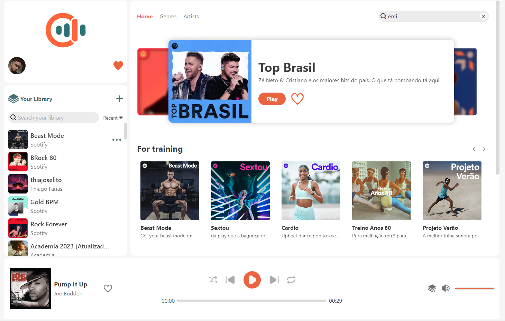
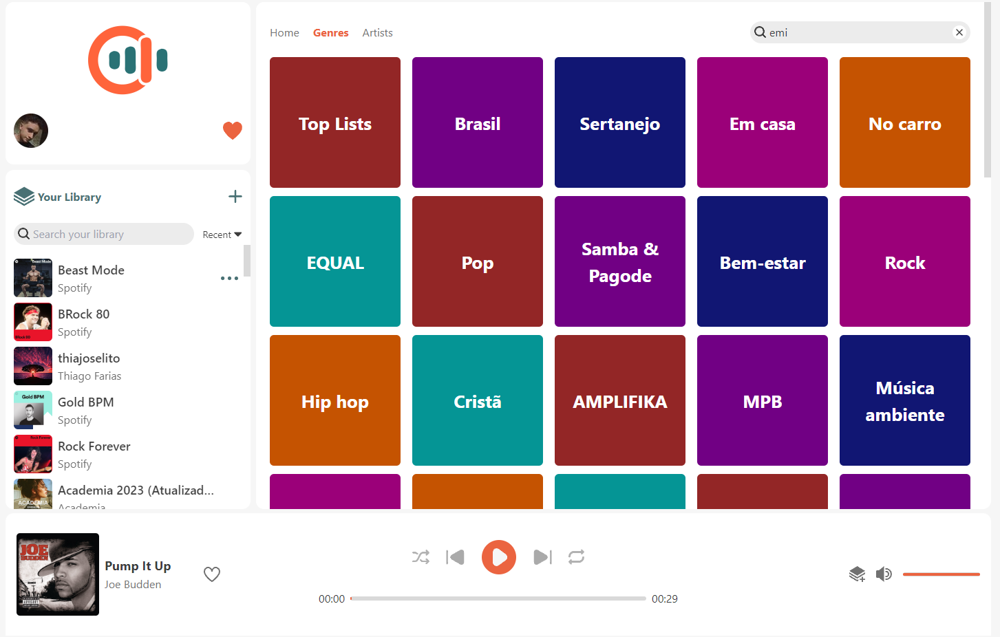
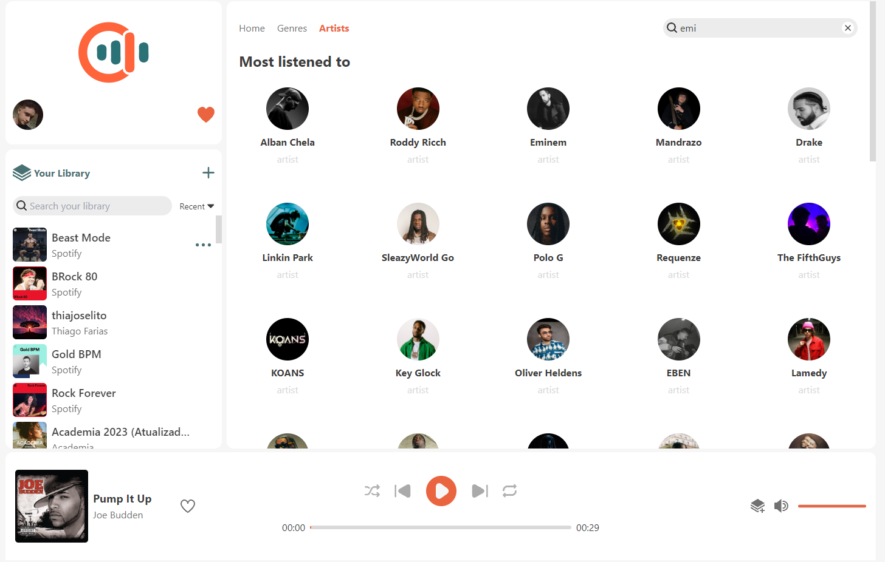
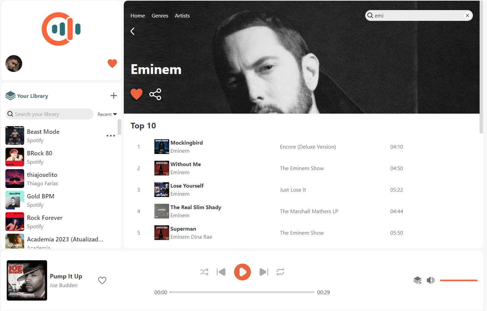
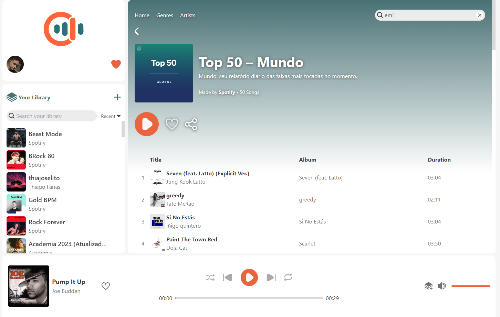
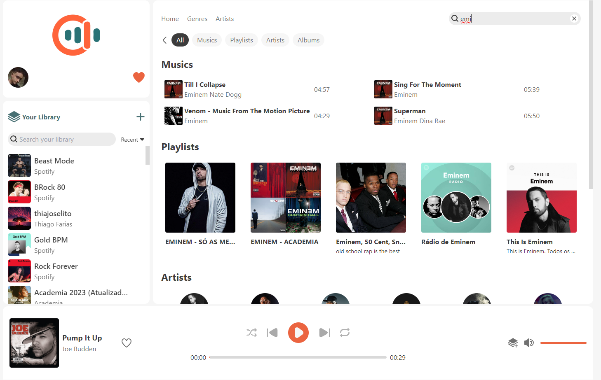

#Musical Thing

- [Introduction](#introduction)
- [Features](#features)
- [Getting Started](#getting-started)
- [References](#references)
- [Design UX/UI](https://www.figma.com/file/2cmRMP5Diw9Io8CYQKfR4y/Musical-Thing?type=design&node-id=0%3A1&mode=design&t=Jr4nDhJ9blkDLgkQ-1)

## Introduction

O Musical Thing é uma aplicação web voltada para streaming de musicas. Os dados das playlists, albuns, musicas, uruarios e artistas sao consultados atraves da [Web API | Spotify For Developers](https://developer.spotify.com/).

## Features
<ul>
  <li>
  Controles:
    <ul>
      <li>Play e pause;</li>
      <li>Próxima música e música anterior;</li>
      <li>Modo aleatório;</li>
      <li>Modos de repetição (Sempre, uma vez);</li>
      <li>Volume (Aumentar, diminuir, mudo).</li>
    </ul>
  </li>
  <li>Criar e editar suas playlists.</li>
  <li>Pesquisar músicas, artistas, playlists e álbuns.</li>
  <li>Seguir/Curtir músicas, artistas, playlists e álbuns.</li>
</ul>

## Getting Started

Primeiro você precisa de um [Spotify Client ID](https://developer.spotify.com/dashboard).

Depois de criar o app, pegue o Client ID:

```
Dashboard > "Nome da aplicacao" > Settings > Basic Information
```
<br>
Você terá que definir um arquivo '.env' e definir as seguintes variáveis:

```
NEXT_PUBLIC_SPOTIFY_CLIENT_ID='YOUR_CLIENT_ID'
NEXT_PUBLIC_SPOTIFY_REDIRECT_URI='http://localhost:3000/'
```
<br>
Run the development server:

```bash
npm run dev
# or
yarn dev
# or
pnpm dev
# or
bun dev
```

Open [http://localhost:3000](http://localhost:3000) with your browser to see the result.
<br>

## Demos
<br>
<br>
<br>
<br>
<br>



### References
[Documentação Web API | Spotify For Developers](https://developer.spotify.com/documentation/web-api)